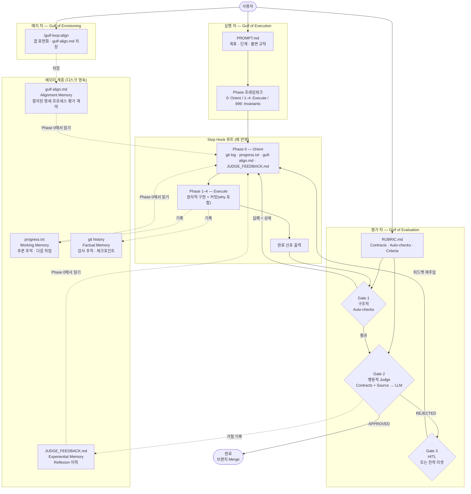

# gulf-loop

Ralph Loop 패턴에 **Human-in-the-Loop** 설계를 결합한 Claude Code 플러그인.
HCI의 실행 차(Gulf of Execution)와 평가 차(Gulf of Evaluation) 개념을 구조적 기반으로 삼는다.

---

## 목차

1. [왜 이걸 만들었는가](#1-왜-이걸-만들었는가)
2. [세 개의 간극](#2-세-개의-간극)
3. [이론적 배경](#3-이론적-배경)
4. [핵심 설계 원칙](#4-핵심-설계-원칙)
5. [구성 요소와 그 이유](#5-구성-요소와-그-이유)
6. [시스템 구조](#6-시스템-구조)
7. [세 가지 모드와 트레이드오프](#7-세-가지-모드와-트레이드오프)
8. [자율 모드의 설계](#8-자율-모드의-설계)
9. [아직 없는 것](#9-아직-없는-것)
10. [설치](#10-설치)
11. [사용법](#11-사용법)
12. [기존 구현과의 비교](#12-기존-구현과의-비교)
13. [참고문헌](#13-참고문헌)

---

## 1. 왜 이걸 만들었는가

### Ralph Loop가 해결한 것

Ralph Loop(Ralph Wiggum 기법)는 Claude Code의 Stop 훅을 이용해 Claude가 응답을 마칠 때마다 같은 프롬프트를 재주입하는 패턴이다. 이것이 해결하는 문제는 하나다: **지속성** — 에이전트가 멈추지 않고 계속 작업하게 만드는 방법.

이 아이디어는 강력하다. 에이전트는 단일 세션에서 처리하기 어려운 큰 작업을 반복적으로 조금씩 진행할 수 있다.

### Ralph Loop가 해결하지 않은 것

그런데 실제로 써보면 한 가지 근본적인 문제가 드러난다.

**루프가 멈추는 조건이 에이전트 자신의 판단이다.**

에이전트가 `<promise>COMPLETE</promise>`를 출력하면 루프가 끝난다. 외부에서 이것을 검증하는 메커니즘이 없다.

이 구조에서 발생하는 문제:

- 에이전트가 스텁 코드를 작성하고 완료라고 할 수 있다.
- 에이전트가 테스트를 삭제하고 완료라고 할 수 있다.
- 에이전트가 잘못된 방향으로 20번 반복한 후 완료라고 할 수 있다.
- 사람은 최종 결과물을 보기 전까지 루프 도중에 무슨 일이 일어났는지 알 수 없다.

**"계속 해"라는 루프를 만든 건데, 뭘 계속 하는지는 여전히 불투명하다.**

gulf-loop는 이 문제를 정면으로 다룬다.

---

## 2. 세 개의 간극

Donald Norman의 *『디자인과 인간 심리(The Design of Everyday Things)』*(1988)는 사람이 시스템과 상호작용할 때 생기는 두 가지 근본적인 간극을 정의한다. 2024년 CHI 연구(Subramonyam et al.)는 LLM 도구에서 이 두 갭 **앞에** 존재하는 세 번째 갭을 새롭게 정의했다.

### 예지 차 (Gulf of Envisioning) — 새로 정의된 갭

*실행을 시작하기 전*, LLM이 무엇을 할 수 있는지조차 상상하기 어려운 간극.

> "인증 모듈을 만들고 싶다. 그런데 에이전트가 내가 원하는 수준으로 실제로 만들 수 있는지 모르겠다. 뭐라고 설명해야 에이전트가 정확히 이해할지도 모르겠다. 완성된 결과물이 어떤 모습일지도 상상하기 어렵다."

세 가지 하위 갭 (Subramonyam et al., CHI 2024):
- **능력 갭** — LLM이 현재 도구와 컨텍스트로 무엇을 할 수 있는지 불명확
- **지시 갭** — 의도를 에이전트가 올바르게 실행할 프롬프트로 변환하기 어려움
- **의도성 갭** — 출력 결과의 형태와 품질을 시작 전에 예측하기 어려움

`/gulf-loop:align`이 이 갭을 루프 시작 전에 해소한다.

### 실행 차 (Gulf of Execution)

*사람이 의도한 것*과 *시스템이 제공하는 행동* 사이의 간극.

> "인증 모듈을 만들고 싶다. 그런데 이 의도를 에이전트가 실제로 올바르게 실행할 수 있는 방식으로 어떻게 전달하지? 어느 파일을 먼저 봐야 하는지, 어떤 단위로 작업해야 하는지, 기존 코드를 얼마나 파악해야 하는지 — 이 모든 맥락이 전달되지 않으면 에이전트는 내가 원하는 방향과 다르게 움직인다."

### 평가 차 (Gulf of Evaluation)

*시스템이 만들어낸 것*과 *사람이 그게 원하던 것인지 판단할 수 있는가* 사이의 간극.

> "루프가 20번 돌고 완료됐다고 한다. 테스트는 통과한다. 그런데 이게 실제로 내가 원하던 거야? 함수들이 단일 책임을 갖고 있나? 에러를 조용히 삼키는 코드가 없나? 나중에 유지보수하기 어려운 구조로 짜인 건 아닌가?"

평가 차를 방치하면 어떤 일이 생기는가: CHI 2025 연구(Lee et al., 319명 실험)에 따르면 AI 신뢰도가 높아질수록 사용자의 비판적 검토 노력이 감소한다. AI를 믿을수록 출력을 덜 검증한다 — **신뢰-평가 역설**이다. METR의 2025 RCT(숙련 OSS 개발자 16명, 246개 태스크)는 AI 도구가 작업 완료 시간을 평균 19% 증가시켰지만 개발자들은 20% 빨라졌다고 인식했다 — 39%p 인식 갭. 외부 judge가 없으면 루프는 이 효과에서 자유롭지 않다.

### AI 에이전트 맥락에서의 재해석

에이전트 루프에서:

- **예지 차** = 루프 시작 전, 에이전트가 작업을 할 수 있는지·어떻게 표현해야 하는지 불명확한 간극. 잘못 표현된 PROMPT는 방향 자체가 틀린 반복을 20번 만든다.
- **실행 차** = 사람의 의도가 에이전트의 실행 방식으로 제대로 전환되지 못하는 간극. 에이전트가 Phase 없이 즉흥적으로 작업하거나, 기존 코드를 확인하지 않고 재구현하거나, 한 반복에 너무 많은 것을 하려다 망가뜨리는 것.
- **평가 차** = 에이전트가 완료라고 했지만 사람이 그게 실제로 올바른지 판단하기 어려운 간극. 테스트가 통과한다고 코드가 좋은 건 아니다. "완료"와 "올바름"은 다르다.

---

## 3. 이론적 배경

### 에이전트 루프 패턴 분류

에이전트 루프 연구에서 정의한 4가지 기본 패턴과 gulf-loop의 위치:

| 패턴 | 구조 | 대표 시스템 | gulf-loop와의 관계 |
|------|------|------------|-------------------|
| **ReAct** | 생각 → 행동 → 관찰 → 반복 | Claude Code, SWE-agent | Phase 0–4 구조의 기반 |
| **Plan-and-Execute** | 계획 전체 생성 → 단계별 실행 | Devin | PROMPT.md의 역할 |
| **Reflexion** | 실행 → 평가 → 언어적 실패 분석 → 재시도 | SWE-agent w/ retry | judge 거절 사이클 전체 |
| **Tree of Thoughts** | k개 후보 경로 생성 → 평가 → 탐색 | o3-style 추론 | 병렬 모드의 개념적 기반 |

gulf-loop는 **ReAct 기반의 Reflexion 강화 루프**다. Phase 0–4가 ReAct의 생각-행동-관찰 구조고, judge 거절 → JUDGE_FEEDBACK.md → 재주입이 Reflexion이다. `/gulf-loop:align`이 루프 전 예지 차를 해소하는 사전 정렬 단계다.

### Gulf of Envisioning — 세 번째 갭

Subramonyam et al.(CHI 2024, arXiv:2309.14459)은 Norman의 두 갭 앞에 LLM 특유의 세 번째 갭이 있다는 것을 실증했다. Terry et al.(2023, arXiv:2311.00710)은 AI 상호작용을 3차원으로 구조화했다:

| 축 | 갭 | gulf-loop 대응 |
|----|----|----------------|
| **명세 정렬** | 무엇을 할지 (실행 차) | PROMPT.md + Phase 프레임워크 |
| **프로세스 정렬** | 어떻게 할지 | Phase 0–4 구조 |
| **평가 정렬** | 출력을 어떻게 검증할지 (평가 차) | RUBRIC.md + judge |
| **예지 정렬** | 할 수 있는지조차 불명확 (예지 차) | `/gulf-loop:align` + gulf-align.md |

gulf-loop는 이 4가지 차원 모두에 구조적 응답을 갖는 루프다.

### Reflexion 루프 — 왜 단순 재시도와 다른가

Shinn et al.(2023)의 Reflexion 패턴은 LLM이 자신의 실패를 언어적으로 분석하고, 그 분석을 다음 시도의 컨텍스트로 직접 사용하는 구조다.

HumanEval 기준: GPT-4 단순 재시도 67% → Reflexion 적용 91%.
AlfWorld 기준: 기본 ReAct 71% → Reflexion 적용 97%.

차이는 단순 재시도가 아니라 **구조화된 실패 분석**이다. gulf-loop의 judge 거절 사이클:

```
1. 에이전트 작업               (Act)
2. Opus judge 평가             (Evaluate)
3. 거절 이유 → JUDGE_FEEDBACK.md  (언어적 실패 분석)
4. 이유를 담아 재주입           (분석을 담아 재시도)
```

JUDGE_FEEDBACK.md가 단순한 로그가 아닌 이유다. 이것은 에이전트의 다음 반복 추론에 직접 주입되는 Reflexion 메모리다.

### 3축 메모리 모델

*Memory in the Age of AI Agents* (arXiv:2512.13564)는 에이전트 메모리를 3개의 축으로 분해한다. gulf-loop의 각 구성요소가 이 분류에서 어디 위치하는지 보면 설계 의도가 명확해진다.

**축 1: 형태(Form)** — 어떤 형식으로 저장하는가

gulf-loop의 모든 메모리는 Token-level 텍스트 파일이다. 이유: 에이전트가 직접 읽고 쓸 수 있고, 사람도 검사할 수 있다. 벡터 DB나 파라미터 업데이트 같은 불투명한 형태를 쓰지 않는다.

**축 2: 기능(Function)** — 무엇을 위해 존재하는가

| 파일 | 메모리 기능 | 역할 |
|------|------------|------|
| `progress.txt` | Working Memory (작업 기억) | 현재 태스크의 상태, 다음 할 일, 의사결정 추론 |
| `JUDGE_FEEDBACK.md` | Experiential Memory (경험 기억) | 어떤 접근이 왜 실패했는가의 누적 이력 |
| `git history` | Factual Memory (사실 기억) | 무엇이 언제 왜 변경됐는가의 감사 추적 |

세 파일의 역할이 다르다. 같은 "파일에 기록한다"는 행위가 목적에 따라 다른 메모리 기능을 수행한다.

**축 3: 동태(Dynamics)** — 어떻게 생성·갱신·검색되는가

```
Formation  (생성):  Phase 1–4 실행 후 → progress.txt 기록
                    Judge 거절 시 → JUDGE_FEEDBACK.md 기록
                    매 커밋 → git history 생성

Retrieval  (검색):  Phase 0에서 세 파일 모두 읽기
                    다음 반복의 추론 컨텍스트로 직접 사용
```

### Lost-in-the-Middle과 max_iterations의 근거

실증 연구에서 측정된 컨텍스트 압력 누적:

```
반복  5:  ~15k 토큰  — 안정적
반복 15:  ~45k 토큰  — 중간 구간 주의 시작
반복 25:  ~70k 토큰  — "Lost in the Middle" 효과 가시화
반복 40+: 75% 임계값 → 자동 컴팩션 트리거
          이전 추론 맥락 대부분 소실
```

컨텍스트 압력이 높아지면:
- 오래된 결정과 그 이유가 유효 주의 범위 밖으로 밀려난다.
- 이전 반복에서 거절된 접근을 "잊고" 다시 시도한다.
- progress.txt를 읽어도 연결되는 추론의 질이 떨어진다.

**max_iterations 50 권장은 단순한 안전장치가 아니다.** 컨텍스트가 누적될수록 추론 품질이 저하된다는 실증적 근거가 있다. 이것이 progress.txt를 간결하게 유지해야 하는 이유이기도 하다. 상세한 기록보다 핵심 추론 경로만 남겨야 한다.

### 루프 실패 모드 분류

에이전트 루프 연구에서 체계화된 실패 패턴과 gulf-loop의 대응:

| 실패 모드 | 원인 | 증상 | gulf-loop 대응 |
|-----------|------|------|----------------|
| **Sycophancy Loop** | 평가 없이 같은 접근 반복 | 미묘하게 변형된 동일 솔루션 반복 | Judge 거절 + Reflexion, 전략 리셋 |
| **Context Pressure Collapse** | 75% 컴팩션 후 추론 맥락 소실 | 이전에 거절된 접근을 재시도 | max_iterations 제한, 간결한 progress.txt |
| **Convergence Failure** | 이전 반복 작업을 되돌림 | "2 steps forward, 1 step back" | Phase 0 필수화, progress.txt 체크 |
| **Metric Gaming** | 완료 신호를 위한 지름길 | 테스트 삭제, 하드코딩, 스텁 | Phase 999 불변 규칙 |
| **Premature Completion** | 검증 없이 완료 선언 | 기준 미충족 상태에서 신호 출력 | autochecks.sh, judge 게이트 |
| **Cold-start Bloat** | Phase 0에서 과도한 읽기 | Orient에 컨텍스트 20%+ 소비 | Phase 0 예산 ≤20% 제한 |

---

## 4. 핵심 설계 원칙

### 원칙 1: 작업자와 평가자를 분리한다

Ralph Loop의 근본적 문제는 **작업한 에이전트가 동시에 완료를 인증한다**는 것이다.

gulf-loop judge 모드에서는 이 두 역할이 분리된다.

- **작업 에이전트**: 코드를 작성하고 완료 신호를 출력한다.
- **평가 에이전트**: 별도의 Claude Opus 인스턴스가 RUBRIC.md 기준으로 독립적으로 평가한다.

작업 에이전트의 완료 선언은 평가 요청일 뿐이다. 평가자가 승인해야 실제로 완료된다. 코드 리뷰의 원칙과 같다: 자신이 짠 코드를 자신이 최종 승인하면 안 된다.

### 원칙 2: HITL은 안전망이 아니라 설계다

HITL 게이트는 "문제가 생겼을 때 사람이 개입한다"는 개념이 아니다.

gulf-loop에서 HITL은 **자동화 평가가 수렴하지 못하는 순간을 감지하고, 그 순간에 제어권을 인간에게 넘기는** 의도적인 설계다.

N번 연속 거절은 두 가지 중 하나를 의미한다:
1. 에이전트가 올바른 방향을 찾지 못하고 있다 → 방향 재설정 필요
2. RUBRIC.md의 기준이 현재 상황에 맞지 않는다 → 기준 업데이트 필요

둘 다 **자동화로 해결할 수 없는 판단**이다. HITL 게이트가 트리거되는 것 자체가 정상 동작이다. 루프가 실패한 게 아니라, 루프가 자신이 해결할 수 없는 문제를 발견해서 사람에게 알린 것이다.

### 원칙 3: "완료"를 사전에 정의한다

암묵적인 완료 기준이 평가 차의 원인이다. RUBRIC.md는 이 정의를 세 층으로 나눈다:

- **Auto-checks**: judge 호출 전 빠른 구조적 게이트 (테스트, 타입 체크, 린트) — 종료 코드만 확인
- **Behavioral contracts**: judge *내부*에서 실행되는 쉘 명령어 — LLM이 출력을 해석하는 행동적 증거. "코드가 무엇을 *하는가*"를 확인
- **Judge criteria**: 행동적 증거 + 소스 파일을 바탕으로 LLM이 평가하는 자연어 요건

각 층은 서로 다른 실패 모드를 잡아낸다. Auto-checks는 구조적 파손을 저렴하게 잡는다. Behavioral contracts는 테스트가 놓치는 인터페이스 위반과 조용한 실패를 잡는다. Judge criteria는 어느 기계도 직접 관찰할 수 없는 설계 수준의 문제를 잡는다.

순서가 있다. 구조적 검사는 기계에게, 행동적 증거는 두 번째로, 해석적 판단은 마지막에.

### 원칙 4: 평가 이력은 영속적이어야 한다

에이전트는 반복마다 새로운 컨텍스트로 시작한다. 이전 반복에서 왜 거절됐는지 기억하지 못하면 같은 실수를 반복한다(Sycophancy Loop). JUDGE_FEEDBACK.md는 모든 거절 이유를 파일로 유지한다. 에이전트는 매 반복 Phase 0에서 이 파일을 읽는다.

---

## 5. 구성 요소와 그 이유

### Phase 프레임워크 — 실행 차를 좁히는 구조

Phase 프레임워크는 매 반복 에이전트에게 주입되는 실행 구조다. 에이전트에게 "뭘 만들어"가 아니라 "어떻게 접근해"를 알려준다.

#### Phase 0: 방향 파악 (Orient)

```
git log --oneline -10
[테스트 명령어]
cat progress.txt
cat JUDGE_FEEDBACK.md  # judge 모드일 때
```

이것이 있는 이유: 에이전트는 매 반복 빈 컨텍스트로 시작한다(Lost-in-the-Middle). Phase 0 없이 바로 작업하면 이미 완료된 작업을 다시 하거나, 실패한 접근을 반복한다. **컨텍스트 예산의 20% 이내로 제한한다** — 더 많이 읽으면 정작 작업할 컨텍스트가 부족해진다.

#### Phase 1–4: 원자적 실행 (Execute)

반복당 하나의 원자적 단위만 구현한다. 하나의 기능, 하나의 버그 수정, 하나의 테스트 추가.

이것이 있는 이유: 한 반복에 너무 많은 것을 하면 검증하기 어렵고, 뭔가 망가졌을 때 어디서 망가졌는지 추적하기 어렵다. 원자적 단위 + 커밋은 자연스러운 체크포인트를 만든다.

```
1. 검색 먼저 — DO NOT ASSUME NOT IMPLEMENTED
2. 완전히 구현 — NO PLACEHOLDERS
3. 테스트 + 린트 + 타입 체크 실행
4. 모두 통과 시 커밋 (why를 메시지 본문에)
5. progress.txt 업데이트 (추론 포함)
```

#### Phase 999+: 불변 규칙 (Invariants)

```
NEVER modify, delete, or skip existing tests
NEVER hard-code values for specific test inputs
NEVER output placeholders or stubs
```

이것이 있는 이유: 에이전트는 완료 신호를 내보내기 위해 지름길을 택할 수 있다(Metric Gaming). Invariants는 이런 부정행위를 명시적으로 금지한다.

### RUBRIC.md — 완료의 명시적 정의

```markdown
---
model: claude-opus-4-6
hitl_threshold: 5
---

## Behavioral contracts
# judge 내부에서 실행 — 출력이 LLM 증거가 됨.
- npm test
- node -e "const {validate} = require('./src/validate'); process.exit(validate(null) === false ? 0 : 1)"

## Auto-checks
# judge 호출 전 빠른 구조적 게이트.
- npx tsc --noEmit
- npm run lint

## Judge criteria
- 모든 함수는 단일하고 명확한 책임을 갖는다.
- 에러 처리는 명시적이다 — 조용한 실패나 빈 catch 블록이 없다.
```

judge는 코드 diff가 아니라 행동적 증거(계약 실행 결과 + 소스 파일)를 기반으로 평가한다. diff 기반 평가가 놓치는 인터페이스 위반과 조용한 실패를 잡아낸다. Judge criteria는 그 증거 위에서 평가되는 자연어 층이다.

### JUDGE_FEEDBACK.md — Reflexion 메모리

매 거절마다 이 파일에 기록된다:

```
---
## 반복 7 — REJECTED (3 consecutive) — 2026-02-27 14:32:01

createUser 함수의 catch 블록이 에러를 삼키고 있습니다.
console.error로 출력하고 있지만 호출자에게 에러를 전파하지 않습니다.
에러는 명시적으로 처리하거나 re-throw해야 합니다.
```

에이전트는 Phase 0에서 이 파일을 읽는다. 단순한 로그가 아니라 Reflexion 패턴에서의 언어적 실패 분석이다. 다음 반복의 추론 컨텍스트로 직접 주입된다.

### progress.txt — 작업 기억 + 추론 추적

에이전트가 매 반복 끝에 스스로 기록하는 파일. 단순한 할 일 목록이 아니라 **의사결정의 추론까지 담아야** 다음 반복 에이전트가 이어받을 수 있다:

```
[반복 3] 완료: 사용자 생성 엔드포인트
         선택: argon2id (bcrypt 제외 — 72바이트 제한, password shucking 취약)
         다음: 비밀번호 해싱
         불확실: rate limiting 엣지 케이스 미검증
```

이렇게 쓰면 다음 반복 에이전트가 "왜 argon2id인지"를 다시 조사하지 않아도 된다.

### .claude/autochecks.sh — 기본 모드의 자동 검증

Judge 없이 기본 모드를 쓸 때도 완료 선언을 검증할 수 있다. 완료 신호 감지 후 자동 실행. 실패 시 완료 거절 + 실패 내용 재주입.

```bash
# .claude/autochecks.sh
#!/usr/bin/env bash
npm test
npx tsc --noEmit
npm run lint
```

---

## 6. 시스템 구조

### 전체 아키텍처



### 세 가지 모드는 하나의 시스템의 설정값

세 모드는 서로 다른 시스템이 아니다. 동일한 stop hook 위에서 Gate 3의 동작과 브랜치 전략만 달라진다.

| 모드 | 예지 차 대응 | Gate 3 동작 | 브랜치 전략 | 언제 쓰는가 |
|------|------------|------------|------------|------------|
| **align** | gulf-align.md 저장 | — (루프 아님) | — | 루프 시작 전 갭 표면화 |
| **기본** | gulf-align.md 읽기 | 없음 (Gate 1만) | 현재 브랜치 | 테스트가 충분해 autochecks로 커버 가능할 때 |
| **Judge** | gulf-align.md 읽기 | HITL 일시정지 | 현재 브랜치 | 코드 품질·설계 기준이 중요하고 사람이 개입 가능할 때 |
| **자율** | gulf-align.md 읽기 | 전략 리셋 | 전용 브랜치 + 자동 merge | 무인 장시간 실행이 필요할 때 |
| **병렬** | gulf-align.md 읽기 | 전략 리셋 × N | N개 worktree + 직렬 merge | 동일 목표를 병렬 전략으로 탐색할 때 |

---

## 7. 세 가지 모드와 트레이드오프

### 기본 모드 (Basic)

**완료 조건**: 에이전트가 완료 신호 출력 + `.claude/autochecks.sh` 통과 (있는 경우)

**트레이드오프**: 평가자가 없다. 에이전트의 완료 선언을 신뢰한다. 코드 품질, 설계 결정 등 주관적 기준은 검증하지 않는다.

### Judge 모드

**완료 조건**: Auto-checks 통과 **AND** Claude Opus judge APPROVED

**트레이드오프**: 매 반복 Opus API 호출 비용이 든다. HITL 게이트가 있어 사람이 개입해야 하는 순간이 생긴다. 느리지만 정확도가 높다.

### 자율 모드 (Autonomous)

**완료 조건**: 기본 또는 Judge 모드와 동일, 단 HITL 없음

**트레이드오프**: HITL이 없다. 에이전트가 잘못된 방향으로 달려도 사람이 개입하지 않는다. 전략 리셋이 HITL을 대체하지만, 이 판단도 자동화된 것이다. **자율 모드는 "더 좋은" 모드가 아니다.** 사람의 판단을 포기하는 대신 처리량을 얻는 트레이드오프다.

---

## 8. 자율 모드의 설계

### 왜 branch 기반인가

자율 모드에서 에이전트는 `gulf/auto-{timestamp}` 브랜치에서 작업한다. main에 직접 커밋하지 않는다.

**main은 항상 검증된 상태여야 한다.** 에이전트가 자율적으로 작업하는 동안 main이 오염되면, 다른 작업자에게 영향을 주고, 문제 발생 시 추적하기 어렵다. 롤백이 아니라 merge다. 문제가 생기면 되돌리는 게 아니라, 처음부터 merge가 성공 조건이다.

### Merge 흐름과 conflict 해소

```
_try_merge
  ├── flock 획득 (~/.claude/gulf-merge.lock)
  │     잠김 → 다음 반복에 재시도
  ├── git fetch + git rebase base_branch
  │     conflict → conflict 해소 태스크로 루프 재진입
  ├── .claude/autochecks.sh 실행
  │     실패 → 실패 상세와 함께 루프 재진입
  └── git merge --no-ff → 종료
```

Merge conflict는 에러가 아니다. 두 독립적인 변경이 같은 파일을 건드렸다는 신호다. conflict 발생 시 에이전트는 다음 지시와 함께 루프로 돌아온다:

1. 양쪽 변경의 의도를 파악한다 (`git log`와 `git show`로)
2. 두 의도를 모두 보존하는 병합 로직을 구현한다
3. 병합된 동작을 검증하는 테스트를 작성한다
4. 기존 테스트가 모두 통과하는지 확인한다
5. 완료 신호를 내보내면 merge가 재시도된다

**테스트가 병합의 정확성 증명이다.** "이쪽이 맞는 것 같다"는 판단이 아니라, 동작하는 코드로 증명한다.

### 커밋 메시지의 "왜"

자율 모드에서 사람은 실시간으로 작업을 볼 수 없다. git history가 유일한 감사 추적이다. "무엇을 했는가"는 diff를 보면 알 수 있다. "왜 이 접근을 선택했는가, 왜 대안을 선택하지 않았는가"는 커밋 메시지가 없으면 사라진다:

```
feat(auth): use argon2id for password hashing

argon2id has stronger memory-hardness than bcrypt and is the current
OWASP recommendation. bcrypt is limited to 72 bytes and vulnerable to
password shucking. argon2id resistance scales with the memory parameter.

bcrypt was considered but ruled out due to the 72-byte limit —
passwords longer than that are silently truncated.
```

5시간 후 루프가 끝났을 때, 커밋 히스토리를 읽으면 에이전트가 어떤 판단을 내리며 작업했는지 재구성할 수 있어야 한다.

### 연속 거절 시 전략 리셋

Judge 모드에서 N번 연속 거절이 발생하면:

- **HITL 모드**: 루프 일시정지 → 사람이 개입
- **자율 모드**: 전략 리셋 → 에이전트가 접근 방식을 근본적으로 바꿔 재시도 + `consecutive_rejections` 초기화

Sycophancy Loop를 끊는 메커니즘이다. 같은 방향의 변형을 반복하는 게 아니라, JUDGE_FEEDBACK.md를 읽고 거절 패턴의 근본 원인을 찾아 다른 전략을 취하도록 강제한다.

---

## 9. 아직 없는 것 (실행 차 간극)

### `/gulf-loop:align` — 구현됨

루프 시작 전 정렬 단계. 에이전트가 `RUBRIC.md`와 기존 코드를 읽고, 4개 섹션으로 구성된 정렬 문서를 `.claude/gulf-align.md`에 저장한다.

```bash
/gulf-loop:align
# 에이전트가 분석하고 저장:
#
# ## Specification Alignment
# Goal: [한 문장으로 핵심 deliverable]
# Deliverables: [완료 시 존재해야 할 구체적 결과물]
# Out of scope: [하지 않을 것]
#
# ## Process Alignment
# Approach: [기술 전략 한 문장]
# Sequence: [순서가 있는 단계별 작업]
#
# ## Evaluation Alignment
# Machine checks: [정확한 검증 명령어]
# Edge cases: [다뤄야 할 경계 조건]
#
# ## Gulf of Envisioning — Gap Check
# Capability gaps: [불확실한 능력 범위]
# Instruction gaps: [명세의 모호한 부분]
# Intentionality gaps: [예측하기 어려운 설계 선택]
# Blocking questions: [사람의 확인이 필요한 것]
```

이후 모든 루프 반복은 Phase 0에서 `gulf-align.md`를 읽는다. 이 문서는 합의된 실행-평가 계약이다. 업데이트 없이 이 계약을 벗어나는 것은 수렴 실패다.

권장 워크플로우:
```bash
/gulf-loop:align                                  # 갭 먼저 표면화
/gulf-loop:start-with-judge "$(cat PROMPT.md)"    # 평가 포함 루프
```

20번 반복 후 방향 수정보다, 0번째에서 방향을 확인하는 게 훨씬 싸다.

### 예정: `milestone_every` — 선제적 체크포인트

현재 HITL 게이트는 반응적이다. 선제적 체크포인트는 judge 결과와 무관하게 일정 간격으로 루프를 일시정지한다.

```yaml
milestone_every: 5  # 5번마다 사람 검토
```

### 예정: `EXECUTION_LOG.md` — Epistemic 핸드오프

에이전트가 매 반복 자신의 실행 이해를 구조화해서 기록하는 컨벤션. 단순한 할 일 목록이 아니라 추론 추적과 불확실성까지 담는다:

```yaml
## 반복 4
completed:
  - task: 사용자 생성 엔드포인트
    confidence: 0.9
    reasoning: "기존 validator.ts 재사용"

decisions:
  - chose: argon2id
    rejected: bcrypt
    reason: "72바이트 제한"
    revisit_if: "레거시 시스템 호환 필요 시"

uncertainties:
  - "rate limiting 엣지 케이스 미검증"

next: 비밀번호 해싱
```

현재 progress.txt는 자유 형식 일기다. 이 포맷은 다음 반복 에이전트가 이전 에이전트의 판단 근거를 구조적으로 이어받게 한다. 결론만이 아니라 추론 경로가 전달된다.

---

## 10. 설치

```bash
git clone https://github.com/subinium/gulf-loop
cd gulf-loop
./install.sh
```

설치 후 Claude Code를 재시작한다.

```bash
./install.sh --uninstall   # 완전히 제거
```

**요구사항**: Claude Code ≥ 1.0.33, `jq`

---

## 11. 사용법

### 기본 모드

```bash
/gulf-loop:start "$(cat PROMPT.md)" --max-iterations 30
```

### Judge 모드

`RUBRIC.md` 먼저 작성 (`RUBRIC.example.md` 참고):

```bash
/gulf-loop:start-with-judge "$(cat PROMPT.md)" \
  --max-iterations 30 \
  --hitl-threshold 5
```

### 자율 모드

```bash
# 기본 자율
/gulf-loop:start-autonomous "$(cat PROMPT.md)" \
  --max-iterations 200 \
  --base-branch main

# 자율 + judge
/gulf-loop:start-autonomous "$(cat PROMPT.md)" \
  --max-iterations 200 \
  --with-judge \
  --hitl-threshold 10
```

### 병렬 모드

```bash
/gulf-loop:start-parallel "$(cat PROMPT.md)" \
  --workers 3 \
  --max-iterations 200 \
  --base-branch main
```

출력된 각 worktree를 별도 Claude Code 세션에서 열고 `/gulf-loop:resume` 실행.

### 명령어 전체 목록

| 명령어 | 설명 |
|--------|------|
| `/gulf-loop:align` | **루프 시작 전 먼저 실행** — 예지·실행·평가 갭을 표면화, `gulf-align.md` 저장 |
| `/gulf-loop:start PROMPT [--max-iterations N] [--completion-promise TEXT]` | 기본 루프 |
| `/gulf-loop:start-with-judge PROMPT [--max-iterations N] [--hitl-threshold N]` | Judge 포함 루프 |
| `/gulf-loop:start-autonomous PROMPT [--max-iterations N] [--base-branch BRANCH] [--with-judge]` | 자율 루프 (HITL 없음) |
| `/gulf-loop:start-parallel PROMPT --workers N [--max-iterations N] [--base-branch BRANCH]` | 병렬 worktree 루프 |
| `/gulf-loop:status` | 현재 반복 횟수 확인 |
| `/gulf-loop:cancel` | 루프 중단 |
| `/gulf-loop:resume` | HITL 일시정지 후 재개 / 사전 초기화된 worktree 시작 |

---

## 12. 기존 구현과의 비교

### vs `anthropics/ralph-wiggum`

동일한 Stop hook 아키텍처. ralph-wiggum의 핵심은 96줄짜리 stop hook — 완료 신호를 확인하고 같은 프롬프트를 재주입한다.

| | ralph-wiggum | gulf-loop |
|---|---|---|
| 설계 프레이밍 | 루프 메커니즘 | HCI gulf 인식 루프 |
| 완료 판정 주체 | 작업 에이전트 본인 | 별도 Opus judge (judge 모드) |
| 루프 패턴 | ReAct | ReAct + Reflexion |
| 실행 차 대응 | 없음 | Phase 프레임워크 + 언어 트리거 매 반복 주입 |
| 평가 차 대응 | 완료 약속만 | RUBRIC.md + behavioral contracts + judge + JUDGE_FEEDBACK.md |
| 메모리 구조 | 없음 | 3축 메모리 (Working/Experiential/Factual) |
| HITL | 없음 | 핵심 설계 — 평가 수렴 실패 시 인간에게 제어권 |
| 자율 모드 | 없음 | 브랜치 기반, 자동 merge, 전략 리셋 |
| 완료 감지 | JSONL 트랜스크립트 파싱 | `last_assistant_message` 필드 직접 사용 |

### vs `snarktank/ralph` (외부 bash 루프)

근본적으로 다른 아키텍처. 외부 루프는 각 반복마다 완전히 새로운 Claude 세션을 시작한다.

| | snarktank/ralph | gulf-loop |
|---|---|---|
| 아키텍처 | 외부 bash → claude 호출 | Stop hook 내부 루프 |
| 반복당 컨텍스트 | 완전 초기화 | 누적 (Lost-in-the-Middle 주의) |
| 적합한 반복 수 | 100번 이상 | 50번 이하 |
| Gulf 인식 | 설계 목표 아님 | 핵심 설계 목표 |

컨텍스트가 누적되는 구조는 이전 반복의 맥락을 활용할 수 있는 장점이 있지만, 장기 실행에서 컨텍스트 압력 붕괴 위험이 있다. 외부 루프 방식은 이 문제가 없다. 사용 사례에 따라 선택한다.

---

## 13. 참고문헌

- Norman, D. A. (1988). *The Design of Everyday Things*. — 실행 차와 평가 차 개념의 원전
- Subramonyam, H. et al. (2024). Bridging the Gulf of Envisioning. *CHI 2024*. arXiv:2309.14459 — 세 번째 갭 (Gulf of Envisioning) 정의
- Terry, M. et al. (2023). Interactive AI Alignment: Specification, Process, and Evaluation Alignment. arXiv:2311.00710 — 3차원 정렬 프레임워크
- Lee, H. et al. (2025). The Impact of Generative AI on Critical Thinking. *CHI 2025*. — 신뢰-평가 역설 실증 (319명, 936개 사례)
- Becker, J. et al. (METR, 2025). Measuring the Impact of Early-2025 AI on Experienced OSS Developer Productivity. arXiv:2507.09089 — 19% 느려지는데 20% 빨라졌다고 인식, 39%p 갭
- Shinn, N. et al. (2023). *Reflexion: Language Agents with Verbal Reinforcement Learning*. arXiv:2303.11366 — Reflexion 패턴
- Wang, L. et al. (2024). *Memory in the Age of AI Agents*. arXiv:2512.13564 — 3축 메모리 모델
- Liu, N. et al. (2023). *Lost in the Middle: How Language Models Use Long Contexts*. — 컨텍스트 압력 실증
- [ghuntley.com/ralph](https://ghuntley.com/ralph) — Geoffrey Huntley, Ralph Loop 기법 창시자
- [anthropics/claude-code plugins/ralph-wiggum](https://github.com/anthropics/claude-code/tree/main/plugins/ralph-wiggum) — 공식 Stop hook 플러그인 (96줄)
- [Claude Code Hooks](https://code.claude.com/docs/en/hooks) — Stop hook 레퍼런스
