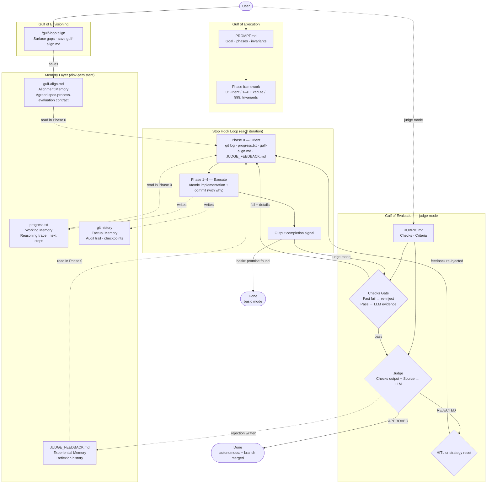

# gulf-loop

Claude Code plugin that brings **Human-in-the-Loop** design into the Ralph Loop pattern,
structured around the HCI concept of execution, evaluation, and envisioning gulfs.

---

## Table of Contents

1. [Why This Exists](#1-why-this-exists)
2. [Three Gulfs](#2-three-gulfs)
3. [Theoretical Background](#3-theoretical-background)
4. [Core Design Principles](#4-core-design-principles)
5. [Components and Why](#5-components-and-why)
6. [System Architecture](#6-system-architecture)
7. [Four Modes and Trade-offs](#7-four-modes-and-trade-offs)
8. [Autonomous Mode Design](#8-autonomous-mode-design)
9. [Recent Additions](#9-recent-additions)
10. [Install](#10-install)
11. [Usage](#11-usage)
12. [Comparison with Existing Ralph Implementations](#12-comparison-with-existing-ralph-implementations)
13. [References](#13-references)

---

## 1. Why This Exists

### What Ralph Loop solved

The Ralph Loop (Ralph Wiggum technique) uses Claude Code's Stop hook to re-inject the same prompt every time Claude finishes a response. It solves one problem: **persistence** — how to make the agent keep working across multiple iterations on a task too large for a single session.

That idea is powerful. An agent can make incremental progress on a large codebase through many small, validated steps.

### What Ralph Loop didn't solve

In practice, one fundamental problem surfaces:

**The loop terminates on the agent's own judgment.**

When the agent outputs `<promise>COMPLETE</promise>`, the loop ends. Nothing external verifies this.

Problems that follow:

- The agent can write stub code and call it done.
- The agent can delete tests to make the suite pass and call it done.
- The agent can iterate in the wrong direction for 20 steps and call it done.
- The human has no visibility into what happened during the loop until seeing the final result.

*You built a "keep going" loop, but what it keeps doing remains opaque.*

gulf-loop addresses this directly.

---

## 2. Three Gulfs

Donald Norman's *The Design of Everyday Things* (1988) defines two fundamental gaps that arise whenever a person interacts with a system. HCI research (Subramonyam et al., CHI 2024) identified a **third gulf** that precedes both in LLM tool interactions.

### Gulf of Envisioning — newly defined

*Before execution even starts*: can the person even envision what the LLM is capable of, and how to specify it correctly?

> "I want to build an auth module. But I don't know if the agent can actually do it at the level I need. I don't know how to describe it so the agent understands correctly. I can't predict what the result will look like before starting."

Three sub-gaps (Subramonyam et al., CHI 2024):
- **Capability gap** — unclear what the LLM can and cannot do given available tools and context
- **Instruction gap** — difficulty translating intent into a prompt the agent executes correctly
- **Intentionality gap** — output form and quality are hard to predict before starting

`/gulf-loop:align` addresses this gulf before the loop starts.

### Gulf of Execution

The gap between *what the person intends* and *what actions the system makes available*.

> "I want to build an auth module. But how do I express that to the agent in a way it actually executes correctly? Which files to look at first, what unit of work per iteration, how much of the existing code to understand first — without all this context, the agent moves in a different direction from what I wanted."

### Gulf of Evaluation

The gap between *what the system produced* and *whether the person can tell if it's what they wanted*.

> "The loop ran 20 iterations and says it's done. Tests pass. But is this actually what I wanted? Do the functions have single responsibility? Is there silent error swallowing? Is it architected in a way that's hard to maintain later?"

**Why evaluation gaps are dangerous**: CHI 2025 research (Lee et al., 319 participants, 936 cases) found that as trust in AI output increases, users' critical review effort *decreases* — the trust-evaluation paradox. The more you trust the AI, the less you verify. A 2025 METR randomized controlled trial (N=16 experienced OSS developers, 246 tasks) found AI tools increased average task completion time by 19%, while developers *perceived* a 20% speedup — a 39-percentage-point perception gap. A loop without external evaluation has no structural protection against either effect.

### In the agent loop context

- **Gulf of Envisioning** = the gap before the loop: unclear whether the agent can do it, how to express it, what the output will look like. A misspecified PROMPT produces 20 iterations going in the wrong direction.
- **Gulf of Execution** = intent not correctly translated into agent execution. The agent works without Phase structure, reimplements existing code without checking, or tries to do too much in one iteration and breaks things.
- **Gulf of Evaluation** = agent says done but the human can't tell if it's actually correct. Tests passing ≠ code is good. "Complete" and "correct" are different things.

---

## 3. Theoretical Background

### Agent loop pattern taxonomy

Four fundamental patterns from agent loop research, and where gulf-loop sits:

| Pattern | Structure | Representative systems | Relation to gulf-loop |
|---------|-----------|----------------------|----------------------|
| **ReAct** | Think → Act → Observe → Repeat | Claude Code, SWE-agent | Basis of Phase 0–4 structure |
| **Plan-and-Execute** | Generate full plan → Execute step by step | Devin | Role of PROMPT.md |
| **Reflexion** | Act → Evaluate → Language analysis of failure → Retry with analysis | SWE-agent w/ retry | The entire judge rejection cycle |
| **Tree of Thoughts** | Generate k candidate paths → Evaluate → Explore | o3-style reasoning | Conceptual basis of parallel mode |

gulf-loop is a **ReAct-based loop with Reflexion augmentation**. Phase 0–4 is ReAct's think-act-observe structure. The judge rejection → JUDGE_FEEDBACK.md → re-injection cycle is Reflexion.

### Reflexion — why it's different from simple retry

Shinn et al. (2023) showed that when LLMs analyze their own failures in natural language and carry that analysis into the next attempt, performance improves dramatically:

- HumanEval: GPT-4 simple retry 67% → Reflexion 91%
- AlfWorld: base ReAct 71% → Reflexion 97%

The difference is not persistence — it's **structured failure analysis**. gulf-loop's judge rejection cycle:

```
1. Agent works                    (Act)
2. Opus judge evaluates           (Evaluate)
3. Rejection reason → JUDGE_FEEDBACK.md  (language analysis of failure)
4. Re-inject with reason attached (retry with analysis)
```

This is why JUDGE_FEEDBACK.md is not just a log. It is the Reflexion memory — directly injected into the next iteration's reasoning context.

### 3-axis memory model

*Memory in the Age of AI Agents* (arXiv:2512.13564) decomposes agent memory into three axes. Each gulf-loop component maps to a different memory function:

**Axis 1: Form** — how is memory stored?

All gulf-loop memory is token-level text files. Reason: the agent can read and write them directly, and the human can inspect them. No opaque vector DBs or parameter updates.

**Axis 2: Function** — what is the memory for?

| File | Memory function | Role |
|------|----------------|------|
| `gulf-align.md` | Alignment Memory | Agreed spec-process-evaluation contract before loop starts |
| `progress.txt` | Working Memory | Current task state, next steps, decision reasoning |
| `JUDGE_FEEDBACK.md` | Experiential Memory | Accumulated history of what approaches failed and why |
| `git history` | Factual Memory | Audit trail of what changed, when, and why |

**Axis 3: Dynamics** — how is memory formed, updated, retrieved?

```
Formation:  After Phase 1–4 → write progress.txt
            On judge rejection → write JUDGE_FEEDBACK.md
            On every commit → git history created
            On loop completion → progress.txt appended to gulf-align.md

Retrieval:  Phase 0 reads all files
            Used directly as reasoning context for the next iteration
            Next loop run inherits completed loop's learnings via gulf-align.md
```

### Lost-in-the-Middle and the basis for max_iterations

Empirically measured context pressure accumulation:

```
Iteration  5:  ~15k tokens  — stable
Iteration 15:  ~45k tokens  — middle-section attention degradation begins
Iteration 25:  ~70k tokens  — "Lost in the Middle" effect visible
Iteration 40+: 75% threshold → auto-compaction triggered
               most prior reasoning context lost
```

As context pressure increases:
- Old decisions and their rationale are pushed outside the effective attention window.
- Approaches rejected in previous iterations are "forgotten" and retried.
- progress.txt is read but the quality of connected reasoning degrades.

**The recommendation of max_iterations ≤ 50 is not just a safety limit.** There is empirical evidence that reasoning quality degrades as context accumulates. This is also why progress.txt should be kept concise — preserve the key reasoning path, not verbose logs.

### Loop failure mode taxonomy

Systematized failure patterns from agent loop research, and gulf-loop's responses:

| Failure mode | Cause | Symptom | gulf-loop response |
|-------------|-------|---------|-------------------|
| **Sycophancy Loop** | No external evaluation, same approach repeated | Subtly varied but equivalent solutions | Judge + Reflexion, strategy reset |
| **Context Pressure Collapse** | Reasoning context lost after 75% compaction | Retries previously rejected approach | max_iterations limit, concise progress.txt |
| **Convergence Failure** | Undoes previous iteration's work | 2 steps forward, 1 step back | Phase 0 mandatory, progress.txt check |
| **Metric Gaming** | Takes shortcuts to produce completion signal | Deletes tests, hardcodes, stubs | Phase 999 invariants |
| **Premature Completion** | Claims done without verification | Outputs signal before criteria met | autochecks.sh (basic), checks gate (judge) |
| **Cold-start Bloat** | Excessive reading in Phase 0 | >20% context budget on Orient | Phase 0 budget ≤20% rule |

---

## 4. Core Design Principles

### Principle 1: Separate the worker from the evaluator

The fundamental problem with vanilla Ralph Loop is that **the agent that did the work also certifies its own completion**.

In gulf-loop judge mode, these two roles are separated:

- **Working agent**: writes code, outputs completion signal.
- **Evaluating agent**: a separate Claude Opus instance independently evaluates against RUBRIC.md criteria.

The working agent's completion claim is only a request for evaluation. The evaluator must approve before the loop actually ends. This is the principle of code review: the person who wrote the code should not be the final approver of their own code.

### Principle 2: HITL is design, not safety net

The HITL gate is not "the human intervenes when something goes wrong."

In gulf-loop, HITL is an **intentional design** that detects moments when automated evaluation cannot converge, and transfers control to the human at those moments.

N consecutive rejections means one of two things:
1. The agent cannot find the right direction → needs redirection
2. RUBRIC.md criteria don't fit the current situation → criteria need updating

Both are **judgments that cannot be automated**. The HITL gate triggering is normal operation. The loop didn't fail — it found a problem it cannot solve and escalated to the human.

### Principle 3: Define "done" before you start

Implicit completion criteria are the cause of evaluation gaps. RUBRIC.md defines this in two layers:

- **Checks**: shell commands that serve a dual role — fast gate (any fail → no Opus call, loop re-injects immediately) and LLM behavioral evidence (output fed to judge when all pass)
- **Judge criteria**: natural-language requirements the LLM evaluates against check output + source files

Two layers, clear separation: give behavioral evidence to the machine first, interpretive judgment last.

### Principle 4: Evaluation history must persist

The agent starts with a fresh context every iteration. If it doesn't remember why it was rejected in previous iterations, it repeats the same mistakes (Sycophancy Loop). JUDGE_FEEDBACK.md maintains all rejection reasons as a file. The agent reads this file in Phase 0 of every iteration.

---

## 5. Components and Why

### Phase framework — narrowing the execution gulf

The Phase framework is injected into the agent every iteration to structure how it executes. It tells the agent not just "what to build" but "how to approach it."

#### Phase 0: Orient

```
git log --oneline -10
[test command]
cat progress.txt
cat .claude/gulf-align.md 2>/dev/null      # alignment contract, if run
cat JUDGE_FEEDBACK.md 2>/dev/null          # judge mode
```

Why this exists: the agent starts every iteration with a nearly empty context (Lost-in-the-Middle). Without Phase 0, it redoes already-completed work or repeats failed approaches. **Budget: ≤20% of context** — reading more leaves insufficient context for the actual work.

> **Iteration 1 (research phase)**: Before Phase 0–4 runs, iteration 1 is dedicated to analysis only. The stop hook validates that `progress.txt` contains an `APPROACH:` field before advancing — if not, iteration 1 is retried. Implementation begins in iteration 2.

#### Phase 1–4: Atomic execution

Implement exactly one atomic unit per iteration. One feature, one bug fix, one test addition.

Why this exists: doing too much in one iteration makes verification harder, and when something breaks, tracing where it broke becomes difficult. Atomic unit + commit creates natural checkpoints.

```
1. Search first — DO NOT ASSUME NOT IMPLEMENTED
2. Implement completely — NO PLACEHOLDERS
3. Run tests + lint + typecheck
4. On all pass: commit (with "why" in message body)
5. Update progress.txt (include reasoning)
```

#### Phase 999+: Invariants

```
999. NEVER modify, delete, or skip existing tests
     A failing test means fix the implementation — not the test.
999. NEVER hard-code values to satisfy specific test inputs
999. NEVER output placeholder or stub implementations
```

Why these exist: agents can take shortcuts to produce a completion signal (Metric Gaming). Invariants explicitly prohibit these shortcuts.

### RUBRIC.md — explicit definition of done

```markdown
---
model: claude-opus-4-6
hitl_threshold: 5
---

## Checks
# Dual role: fast gate (any fail → re-inject, no Opus call) + LLM behavioral evidence.
# Use commands that produce meaningful output on failure.
- npm test
- npx tsc --noEmit
- npm run lint
- node -e "const {validate} = require('./src/validate'); process.exit(validate(null) === false ? 0 : 1)"

## Judge criteria
- Every function has a single, clear responsibility.
- Error handling is explicit — no silent failures or empty catch blocks.
```

The judge evaluates behavioral evidence (contract execution results + source files), not code diffs. This catches interface violations and silent failures that diff-based evaluation misses. Judge criteria are the natural-language layer evaluated on top of that evidence.

### JUDGE_FEEDBACK.md — Reflexion memory

Written on every rejection:

```
---
## Iteration 7 — REJECTED (3 consecutive) — 2026-02-27 14:32:01

The catch block in createUser swallows the error silently.
It logs to console.error but does not propagate the error to the caller.
Errors must be explicitly handled or re-thrown.
```

The agent reads this file in Phase 0. This is not just a log — it is language analysis of failure in the Reflexion pattern, directly injected into the next iteration's reasoning context.

### JUDGE_EVOLUTION.md — judge growth log

Written on every judge decision (approval or rejection). Each entry is a principle extracted from that decision:

```
[iter 3] REJECTED — prefer explicit error propagation over silent catch blocks
[iter 5] APPROVED — consistent error structure across all async handlers
[iter 8] REJECTED — watch for hardcoded test values in boundary conditions
```

The stop hook feeds the last 40 lines of this file back to the judge on every call. The judge sees its own accumulated reasoning patterns — preventing repeated judgment errors across iterations.

### progress.txt — working memory + reasoning trace

Written by the agent at the end of every iteration. Not just a todo list — **must include decision reasoning** for the next iteration's agent to build on:

```
ORIGINAL_GOAL: [copy from gulf-align.md or RUBRIC — never change]
ITERATION: 3

COMPLETED:
- user creation endpoint (confidence: 90)

DECISIONS:
- chose: argon2id, rejected: bcrypt, reason: 72-byte limit + password shucking risk, revisit_if: bcrypt parity required

UNCERTAINTIES:
- rate limiting edge cases not yet verified

REMAINING_GAP:
- password hashing implementation

CONFIDENCE: 75
```

Written this way, the next iteration's agent doesn't need to re-investigate "why argon2id." The structured format prevents goal drift across iterations (OnGoal, UIST 2025).

### .claude/autochecks.sh — automated verification

Even without a judge, completion claims can be verified. In basic mode: runs after completion signal detection. In autonomous mode: also runs post-rebase before merging. On failure: completion rejected + failure output re-injected.

```bash
# .claude/autochecks.sh
#!/usr/bin/env bash
npm test
npx tsc --noEmit
npm run lint
```

---

## 6. System Architecture

### Full architecture



### Three modes as configuration of one system

The three modes are not different systems. They are the same stop hook with different Gate 3 behavior and branch strategy.

| Mode | Envisioning | Gate 3 | Branch strategy | When to use |
|------|-------------|--------|----------------|-------------|
| **align** | saves gulf-align.md | — (not a loop) | — | Surface gaps before the loop |
| **basic** | reads gulf-align.md | none (optional autochecks.sh) | current branch | When tests are sufficient to cover completion |
| **judge** | reads gulf-align.md | HITL pause | current branch | When code quality/design criteria matter and human can intervene |
| **autonomous** | reads gulf-align.md | strategy reset | dedicated branch + auto-merge | When unattended long-running execution is needed |
| **parallel** | reads gulf-align.md | strategy reset × N | N worktrees + serialized merge | When exploring the same goal with parallel strategies |

---

## 7. Four Modes and Trade-offs

### Basic mode

**Completion condition**: agent outputs completion signal + `.claude/autochecks.sh` passes (if present)

**Trade-off**: no evaluator. The agent's completion claim is trusted. Subjective criteria — code quality, design decisions — are not verified.

### Judge mode

**Completion condition**: checks pass **AND** Claude Opus judge APPROVED

**Trade-off**: Opus API cost on every iteration. HITL gate creates moments requiring human intervention. Slower, but higher accuracy.

### Autonomous mode

**Completion condition**: same as basic or judge mode, but no HITL

**Trade-off**: no HITL. If the agent runs in the wrong direction, no human intervenes. Strategy reset replaces HITL, but this judgment is also automated. **Autonomous mode is not "better" mode.** It is a trade-off: you give up human judgment in exchange for throughput.

### Parallel mode

**Completion condition**: same as basic or judge (per worker) — each worker merges its branch to the base branch independently when done.

**Trade-off**: requires opening N separate Claude Code sessions manually after setup. Non-determinism is a feature — workers run the same PROMPT but can diverge in approach. Best for exploratory execution (multiple strategies for the same goal) or redundancy. For decomposed sub-tasks (different goals), run separate sequential loops instead.

### Stop hook flow

#### Basic mode
```
Stop event
  ├── No state file → allow stop
  ├── active: false (paused) → show resume instructions, exit
  ├── iteration ≥ max_iterations → delete state file, stop
  ├── milestone_every > 0 AND iteration % milestone_every == 0
  │     → set active: false, pause_reason: milestone, exit
  │       (review progress.txt → /gulf-loop:resume to continue)
  ├── iteration == 1 AND progress.txt missing APPROACH: field
  │     → re-inject without incrementing (research phase gate)
  │       (agent retries iteration 1 until APPROACH: is written)
  ├── <promise>COMPLETE</promise> in last message
  │     .claude/autochecks.sh exists? → run it
  │       Pass → _on_complete: append progress.txt → gulf-align.md, delete state
  │       Fail → increment, re-inject with failure output
  │     No autochecks.sh → _on_complete, stop
  └── Otherwise → increment iteration, re-inject prompt + framework
```

#### Judge mode
```
Stop event
  ├── No state file → allow stop
  ├── active: false (paused) → show resume instructions, exit
  ├── iteration ≥ max_iterations → delete state file, stop
  ├── milestone_every > 0 AND iteration % milestone_every == 0
  │     → set active: false, pause_reason: milestone, exit
  ├── iteration == 1 AND progress.txt missing APPROACH: field
  │     → re-inject without incrementing (research phase gate)
  ├── [Checks Gate] Run RUBRIC.md ## Checks — all commands must exit 0
  │     Any fail → increment, re-inject with failure details (no Opus call)
  │     All pass → output becomes LLM behavioral evidence ↓
  ├── [Judge] Claude Opus evaluates:
  │     1. ## Checks output (behavioral evidence — what the code actually does)
  │     2. Changed source files (actual content, not diff)
  │     3. ## Judge criteria (natural-language requirements)
  │     APPROVED → _on_complete: append progress.txt → gulf-align.md, delete state
  │     REJECTED → write JUDGE_FEEDBACK.md, increment, re-inject with reason
  │     N consecutive REJECTED → HITL pause (judge) or strategy reset (autonomous)
```

---

## 8. Autonomous Mode Design

### Why branch-based

In autonomous mode, the agent works on a `gulf/auto-{timestamp}` branch. It never commits directly to main.

**Main must always be in a verified state.** If main gets polluted while the agent works autonomously, it affects other workers and becomes hard to trace when problems occur. The mental model is not rollback-on-failure — it is **merge-as-success-condition**. The loop doesn't end until the branch merges cleanly.

### Merge flow and conflict resolution

```
_try_merge
  ├── Acquire flock (~/.claude/gulf-merge.lock)
  │     Locked → retry merge next iteration
  ├── git fetch + git rebase base_branch
  │     Conflict → re-inject conflict resolution task
  ├── Run .claude/autochecks.sh
  │     Fail → re-inject with failure details
  └── git merge --no-ff → done
```

A merge conflict is not an error. It is a signal that two independent changes touched the same file. On conflict, the agent re-enters the loop with:

1. Understand the intent of both sides (`git log` and `git show`)
2. Implement merged logic that preserves the intent of both sides
3. Write tests that verify the merged behavior
4. Confirm all existing tests still pass
5. Output completion signal → merge is retried automatically

**Tests are the proof of merge correctness.** Not "this side seems right" — but working code that proves it.

### Commit message "why"

In autonomous mode, the human cannot watch the work in real time. Git history is the only audit trail. "What was done" is visible in the diff. "Why this approach, why not the alternative" disappears without commit messages:

```
feat(auth): use argon2id for password hashing

argon2id has stronger memory-hardness than bcrypt and is the current
OWASP recommendation. bcrypt is limited to 72 bytes and is vulnerable to
password shucking. argon2id resistance scales with the memory parameter.

bcrypt was considered but ruled out due to the 72-byte limit —
passwords longer than that are silently truncated.
```

When the loop ends after 5 hours, reading the commit history should let you reconstruct what judgments the agent made while working.

### Strategy reset on consecutive rejections

In judge mode when N consecutive rejections occur:

- **HITL mode**: loop pauses → human intervenes
- **Autonomous mode**: strategy reset → agent fundamentally changes its approach and retries + resets `consecutive_rejections`

This is the mechanism for breaking out of the Sycophancy Loop. Instead of repeating variations of the same direction, it reads JUDGE_FEEDBACK.md to find the root cause of the rejection pattern and takes a different strategy.

---

## 9. Recent Additions

### `--force-max` — always run to max iterations

By default, the loop ends as soon as the completion signal is output (or judge approves). `--force-max` overrides this: the loop acknowledges the signal but keeps running until `max_iterations` is reached.

```bash
/gulf-loop:start "refactor the auth module" --max-iterations 10 --force-max
```

Useful when you want exhaustive refinement — the agent continues improving even after it's confident the task is done. The loop exits cleanly at max iterations via the normal max-iterations gate.

In judge mode, a judge approval with `--force-max` resets `consecutive_rejections` to 0 and continues iterating.

### `milestone_every` — proactive HITL checkpoints

Pause the loop every N iterations for human review, independent of judge outcomes.

```bash
/gulf-loop:start-with-judge "$(cat PROMPT.md)" --milestone-every 5
```

```yaml
---
active: true
iteration: 7
milestone_every: 5        # pause every 5 iterations for human review
---
```

At iterations 5, 10, 15: loop sets `active: false` and exits. Review `progress.txt`, then run `/gulf-loop:resume` to continue.

### Enhanced `progress.txt` — epistemic handoff

The structured `progress.txt` format now includes decision rationale and uncertainties:

```
ORIGINAL_GOAL: [from gulf-align.md or RUBRIC]
ITERATION: [N]

COMPLETED:
- [task — what, why, confidence 0-100]

DECISIONS:
- chose: [X], rejected: [Y], reason: [why], revisit_if: [condition]

UNCERTAINTIES:
- [what you're not sure about]

REMAINING_GAP:
- [next task]

CONFIDENCE: [0-100]
```

This passes decision rationale to the next iteration — not just conclusions, but the reasoning path. Replaces the previously planned `EXECUTION_LOG.md`.

### Research phase — iteration 1 as multi-perspective analysis

Iteration 1 is now a dedicated research phase. The agent does **not** modify source files — it analyzes the task from four perspectives and writes findings to `progress.txt`.

| Perspective | Focus |
|-------------|-------|
| **Defender** | What already works well? What should not change? |
| **Critic** | What is fundamentally weak or wrong? What assumption in the request might be flawed? |
| **Risk Scout** | Where does the obvious approach break? What edge cases are invisible? |
| **Gap Detector** | What is unspecified in the request? What decisions haven't been made yet? |

The four perspectives may conflict. The synthesis — written to `progress.txt` as `APPROACH` — navigates the tension rather than blindly implementing all findings. Implementation begins in iteration 2.

```
ITERATION: 1 (research phase)

STRENGTHS:
- [Defender — what to preserve]

RISKS:
- [Critic + Risk Scout — ranked concerns]

GAPS:
- [Gap Detector — unspecified decisions]

APPROACHES_CONSIDERED:
- [approach A]: [why rejected]
- [approach B]: [why rejected]

APPROACH:
[one paragraph: what, in what order, and why over alternatives]

CONFIDENCE: [30–100]
```

The stop hook enforces `APPROACH:` (≥ 50 chars), `APPROACHES_CONSIDERED:` (≥ 1 entry), and `CONFIDENCE:` (≥ 30) before advancing to iteration 2.

This addresses cold-start context loss — the agent maps the problem space before touching any code.

### Inter-loop handoff — `progress.txt → gulf-align.md`

On loop completion, the stop hook appends `progress.txt` to `.claude/gulf-align.md`. The next loop run starts with accumulated learnings from all prior loops — not a blank context.

```
.claude/gulf-align.md
├── pre-loop alignment (from /gulf-loop:align or written manually)
└── ## Loop completed — 2026-02-28 14:22:11 | iteration 23
    [progress.txt contents appended here]
```

Running the loop twice on the same task is structurally better than running it once: the second run has richer ambient context from the first run's research phase and completed work.

### gulf-align.md — 4-section format

Created by `/gulf-loop:align` (or written manually) and read at the start of every iteration. It addresses all three gulfs simultaneously:

| Section | Gulf | Contents |
|---------|------|----------|
| **Specification Alignment** | Envisioning | Goal, deliverables, out of scope |
| **Process Alignment** | Execution | Technical approach, ordered phases, stack assumptions |
| **Evaluation Alignment** | Evaluation | Machine checks (exact commands), behavioral checks, edge cases |
| **Gulf of Envisioning — Gap Check** | Envisioning | Capability gaps, ambiguous spec parts, blocking questions |

You can write it manually without `/gulf-loop:align`:

```markdown
## Specification Alignment
- **Goal**: [one sentence — the core deliverable]
- **Deliverables**: [list of artifacts]
- **Out of scope**: [what you will NOT do]

## Process Alignment
- **Approach**: [technical strategy in one sentence]
- **Sequence**: [ordered phases, each with a verifiable artifact]
- **Stack assumptions**: [languages, frameworks, test tools]

## Evaluation Alignment
- **Machine checks**: [`npm test`, `tsc --noEmit`, `npm run lint`]
- **Behavioral checks**: [what the running system must do]
- **Edge cases**: [known boundaries the implementation must handle]

## Gulf of Envisioning — Gap Check
- **Capability gaps**: [things uncertain to implement]
- **Instruction gaps**: [ambiguous or contradictory spec parts]
- **Blocking questions**: [requires user clarification before starting]
```

If `Blocking questions` is non-empty, resolve them before running `/gulf-loop:start`.

### When a task is too large — loop decomposition

The [Lost-in-the-Middle](#lost-in-the-middle-and-the-basis-for-max_iterations) effect degrades reasoning past ~iteration 40. For large tasks, split into sequential loops:

```
Loop 1:  /gulf-loop:align + /gulf-loop:start   → architecture decisions, research brief
Loop 2:  /gulf-loop:start                      → implement core feature A
                                                  (reads Loop 1's gulf-align.md)
Loop 3:  /gulf-loop:start                      → implement feature B + integration
                                                  (reads Loop 1 + Loop 2 via gulf-align.md)
```

Each loop completion appends `progress.txt` to `gulf-align.md`, so later loops inherit the full decision history from earlier ones.

**Split signal**: if your RUBRIC has > 8–10 acceptance criteria, or you anticipate > 40 iterations — break the task into sequential loops.

### Judge evolution — self-improving judgment

In judge mode, the stop hook appends a `META:` principle to `JUDGE_EVOLUTION.md` after every judge decision:

```
[iter 3] REJECTED — prefer explicit error propagation over silent catch blocks
[iter 5] APPROVED — consistent error structure across all async handlers
```

The last 40 lines of this file are fed back to the judge on every subsequent call. The judge sees its own accumulated reasoning — reducing repeated judgment errors across a long loop run.

### Structured memory wiki — cross-iteration knowledge base

Pass `--structured-memory` to any start command to scaffold a persistent, topically organized knowledge base at `.claude/memory/`:

```bash
/gulf-loop:start "build the feature" --structured-memory
# or
bash scripts/setup.sh --mode judge --structured-memory "$(cat PROMPT.md)"
```

This creates:

```
.claude/memory/
├── INDEX.md           ← master index; auto-updated by stop hook on completion
├── spec.md            ← goals + completion criteria (agent fills in iteration 1)
├── map.md             ← codebase map (agent appends as it explores)
├── constraints.md     ← discovered constraints, append-only
├── decisions/         ← per-topic decision files (agent creates as needed)
│   └── <topic>.md
└── loops/
    ├── current.md     ← progress this loop (agent appends; reset on completion)
    ├── loop-001.md    ← completed loop 1 archive (immutable)
    └── loop-002.md    ← completed loop 2 archive (immutable)
```

**How it works:**

| Event | What happens |
|-------|-------------|
| `--structured-memory` on init | Scaffold created; `structured_memory: true` written to state file |
| Iteration 1 (research phase) | Agent fills in `spec.md`; initializes `loops/current.md` |
| Each iteration | Agent appends to `loops/current.md`, `map.md`, `constraints.md`, creates `decisions/<topic>.md` |
| Loop completion | Stop hook archives `loops/current.md` → `loops/loop-NNN.md`; inserts link in `INDEX.md` |
| Next loop run | Agent reads `INDEX.md` first; follows links to relevant files |

**Why this beats a single flat file:**

| Problem with flat files | Structured wiki fix |
|------------------------|---------------------|
| Position bias — recent entries weighted more than early ones | `spec.md` is always fresh; decisions/ are topical, not chronological |
| Single file grows unbounded → cold-start bloat | INDEX.md stays small; per-topic files contain only what's relevant |
| All or nothing — read everything or miss context | Agent follows only relevant links in Phase 0 |
| No immutable history | Completed loops archived with timestamps; never overwritten |

**When to use:** long tasks spanning multiple loops, refactor work with many trade-off decisions, teams running the same project across sessions.

**When to skip:** short single-loop tasks where `progress.txt` + `gulf-align.md` is sufficient.

---

## 10. Install

```bash
git clone https://github.com/subinium/gulf-loop
cd gulf-loop
./install.sh
```

Restart Claude Code after install.

```bash
./install.sh --uninstall   # remove completely
```

### Plugin file structure

After install, the plugin lives at `~/.claude/plugins/gulf-loop/`:

```
~/.claude/plugins/gulf-loop/
├── hooks/stop-hook.sh          # Core loop mechanism — fires on every Stop event
├── scripts/
│   ├── setup.sh                # Loop initializer (all 4 modes)
│   ├── run-judge.sh            # Execution-first LLM evaluator
│   ├── run-align.sh            # Alignment phase prereq check
│   ├── resume-loop.sh          # Resume from HITL/milestone pause
│   ├── cancel-loop.sh          # Cancel active loop
│   └── status-loop.sh          # Show current iteration
└── prompts/framework.md        # Phase 0–4 framework injected every iteration

~/.claude/commands/             # Installed slash commands
├── gulf-loop:align.md
├── gulf-loop:start.md
├── gulf-loop:start-with-judge.md
├── gulf-loop:start-autonomous.md
├── gulf-loop:start-parallel.md
├── gulf-loop:resume.md
├── gulf-loop:cancel.md
└── gulf-loop:status.md
```

Runtime files (created in your project directory during loop execution):

```
your-project/
├── RUBRIC.md                   # Completion criteria (judge mode, you create this)
├── decisions.md                # Append-only decisions log (auto-written by stop hook)
├── JUDGE_FEEDBACK.md           # Reflexion memory (auto-written by stop hook)
├── JUDGE_EVOLUTION.md          # Judge growth log — accumulated judgment principles
├── progress.txt                # Working memory (agent writes each iteration)
└── .claude/
    ├── gulf-loop.local.md      # Loop state file (frontmatter + original prompt)
    ├── gulf-align.md           # Alignment memory (from /gulf-loop:align or manual)
    └── autochecks.sh           # Optional: automated checks for basic/autonomous mode
```

**Requirements**: Claude Code ≥ 1.0.33, `jq`

---

## 11. Usage

### Recommended workflow (all modes)

```bash
/gulf-loop:align                                       # surface gaps first
/gulf-loop:start-with-judge "$(cat PROMPT.md)"         # loop with evaluation
```

### Basic mode

Completion = agent outputs `<promise>COMPLETE</promise>`.

```bash
/gulf-loop:start "$(cat PROMPT.md)" --max-iterations 30
```

Optionally, add `.claude/autochecks.sh` to your project. If present and executable, it runs after the completion promise is detected — if it fails, completion is rejected and the agent is re-injected with the failure output.

### Judge mode (Gulf of Evaluation fully activated)

Completion = checks pass **AND** Opus judge approves.

Create `RUBRIC.md` first (see `RUBRIC.example.md`), then:

```bash
/gulf-loop:start-with-judge "$(cat PROMPT.md)" \
  --max-iterations 30 \
  --hitl-threshold 5
```

### Autonomous mode (no human intervention)

```bash
# Basic autonomous
/gulf-loop:start-autonomous "$(cat PROMPT.md)" \
  --max-iterations 200 \
  --base-branch main

# Autonomous + judge
/gulf-loop:start-autonomous "$(cat PROMPT.md)" \
  --max-iterations 200 \
  --with-judge \
  --hitl-threshold 10
```

### Parallel mode (multiple worktrees)

Creates N git worktrees, each running an independent autonomous loop on its own branch. Merges are serialized automatically via flock — no manual coordination needed.

```bash
/gulf-loop:start-parallel "$(cat PROMPT.md)" \
  --workers 3 \
  --max-iterations 200 \
  --base-branch main
```

Then open each printed worktree path in a separate Claude Code session and run `/gulf-loop:resume`.

**Merge flow:**
- First worker to complete acquires lock → rebases → merges
- Subsequent workers rebase on the updated base branch → merge in turn
- Any merge conflict is resolved autonomously by the worker that encounters it

### Commands

| Command | Description |
|---------|-------------|
| `/gulf-loop:align` | **Run before starting** — surfaces envisioning/execution/evaluation gaps, saves `gulf-align.md` |
| `/gulf-loop:start PROMPT [--max-iterations N] [--completion-promise TEXT] [--milestone-every N] [--force-max]` | Basic loop |
| `/gulf-loop:start-with-judge PROMPT [--max-iterations N] [--hitl-threshold N] [--milestone-every N] [--force-max]` | Loop with judge |
| `/gulf-loop:start-autonomous PROMPT [--max-iterations N] [--base-branch BRANCH] [--with-judge] [--hitl-threshold N] [--milestone-every N] [--force-max]` | Autonomous loop (no HITL) |
| `/gulf-loop:start-parallel PROMPT --workers N [--max-iterations N] [--base-branch BRANCH] [--with-judge] [--milestone-every N] [--force-max]` | Parallel worktree loops |
| `/gulf-loop:status` | Current iteration count |
| `/gulf-loop:cancel` | Stop the loop |
| `/gulf-loop:resume` | Resume after HITL pause (or start pre-initialized worktree) |

### PROMPT.md template

```markdown
## Goal
[One paragraph: what is the deliverable?]

## Current State
[Point to files/commands — the agent re-reads this every iteration.
Make state discoverable, not embedded.]

## Acceptance Criteria
- [ ] npm test returns exit code 0
- [ ] No TypeScript errors (tsc --noEmit)
- [ ] ESLint clean

## Phase 0 — Orient
- Run: git log --oneline -10
- Run: npm test
- Check: progress.txt
- Check: .claude/gulf-align.md

## Phase 1–4 — Execute
1. Pick next incomplete task
2. Search first — DO NOT ASSUME NOT IMPLEMENTED
3. Implement completely — NO PLACEHOLDERS
4. Run: npm test && npm run lint && npx tsc --noEmit
5. On all pass: git commit -m "feat: [task]" (with why in body)
6. Append to progress.txt

## Phase 999 — Invariants
999. NEVER modify, delete, or skip existing tests
999. NEVER hard-code values
999. NEVER implement placeholders

Output <promise>COMPLETE</promise> ONLY when ALL acceptance criteria above pass.
```

### RUBRIC.md template

```markdown
---
model: claude-opus-4-6
hitl_threshold: 5
---

## Envisioning
<!-- Optional. Filled by /gulf-loop:align. -->

## Checks
# Dual role: fast gate (any fail → re-inject, no Opus call) + LLM behavioral evidence.
# Use commands that produce meaningful output on failure.
- npm test
- npx tsc --noEmit
- npm run lint

## Judge criteria
- Every function has a single, clear responsibility.
- Error handling is explicit — no silent failures or empty catch blocks.
- No hardcoded secrets, URLs, or environment-specific values.
- No placeholder code: no TODOs, no stub implementations.
- Edge cases (null, empty, boundary values) are handled explicitly.
```

---

## 12. Comparison with Existing Ralph Implementations

### vs `anthropics/ralph-wiggum`

Same Stop hook architecture. ralph-wiggum's core is a 96-line stop hook — detects the completion signal and re-injects the same prompt.

| | ralph-wiggum | gulf-loop |
|---|---|---|
| Design framing | Loop mechanism | HCI gulf-aware loop |
| Completion arbiter | Working agent itself | Separate Opus judge (judge mode) |
| Loop pattern | ReAct | ReAct + Reflexion |
| Gulf of Execution | None | Phase framework + language triggers every iteration |
| Gulf of Evaluation | Completion promise only | RUBRIC.md + checks (dual-role gate + evidence) + judge + JUDGE_FEEDBACK.md |
| Gulf of Envisioning | None | `/gulf-loop:align` + gulf-align.md |
| Memory structure | None | 4-layer (Alignment/Working/Experiential/Factual) + inter-loop handoff |
| Cold-start analysis | None | Research phase: iteration 1 = 4-perspective analysis before any code change |
| HITL | None | Core design — hands control to human when evaluation diverges |
| Autonomous mode | None | Branch-based, auto-merge, strategy reset |
| Completion detection | JSONL transcript parsing | `last_assistant_message` field |

### vs `snarktank/ralph` (external bash loop)

Fundamentally different architecture. External loop = completely fresh Claude session each iteration.

| | snarktank/ralph | gulf-loop |
|---|---|---|
| Architecture | External bash → calls claude | Stop hook internal loop |
| Context per iteration | Fully reset | Accumulates |
| Best for | 100+ iterations | ≤50 iterations |
| Gulf awareness | Not a design goal | Core design goal |

Accumulating context allows leveraging prior iteration context — but carries the risk of context pressure collapse in long runs. The external loop approach avoids this. Choose based on your use case.

---

## 13. References

- Norman, D. A. (1988). *The Design of Everyday Things*. — Gulf of Execution and Evaluation
- Subramonyam, H. et al. (2024). Bridging the Gulf of Envisioning. *CHI 2024*. arXiv:2309.14459 — Gulf of Envisioning: three sub-gaps in LLM tool interactions
- Terry, M. et al. (2023). Interactive AI Alignment: Specification, Process, and Evaluation Alignment. arXiv:2311.00710 — 3-axis alignment framework (specification / process / evaluation)
- Lee, H. et al. (2025). The Impact of Generative AI on Critical Thinking. *CHI 2025*. — Trust-evaluation paradox: 319 participants, 936 cases
- Becker, J. et al. (METR, 2025). Measuring the Impact of Early-2025 AI on Experienced OSS Developer Productivity. arXiv:2507.09089 — 19% slower, 20% perceived speedup, 39pp gap
- Shinn, N. et al. (2023). Reflexion: Language Agents with Verbal Reinforcement Learning. arXiv:2303.11366 — Reflexion loop pattern
- Wang, L. et al. (2024). Memory in the Age of AI Agents. arXiv:2512.13564 — 3-axis memory model (Form × Function × Dynamics)
- Liu, N. et al. (2023). Lost in the Middle: How Language Models Use Long Contexts. — Context pressure empirical data
- [ghuntley.com/ralph](https://ghuntley.com/ralph) — Geoffrey Huntley, originator of the Ralph Loop technique
- [anthropics/claude-code plugins/ralph-wiggum](https://github.com/anthropics/claude-code/tree/main/plugins/ralph-wiggum) — Official Stop hook plugin (96 lines)
- [Claude Code Hooks](https://code.claude.com/docs/en/hooks) — Stop hook reference
